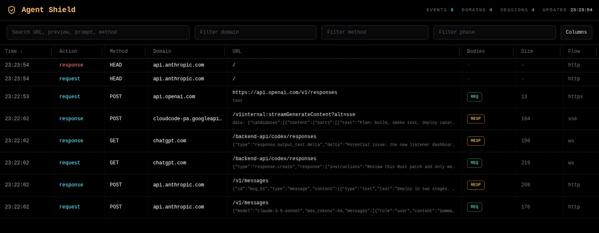
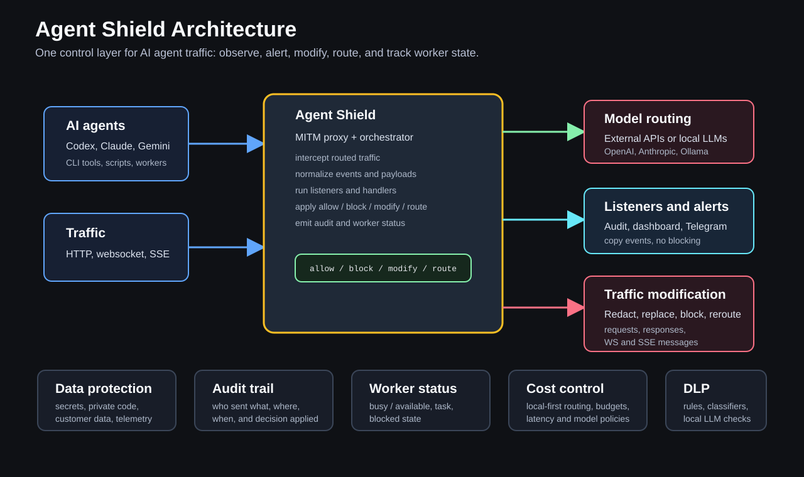

# Agent Shield Rust Proxy

MITM proxy and dashboard for AI CLI traffic.

## Use Cases

- See what AI CLI tools actually send to model providers over HTTP, websocket, and SSE.
- Catch secrets, tokens, private code, customer fragments, and telemetry before they leave the machine or network.
- Attach listener callbacks for audit logs, Telegram alerts, dashboards, analytics, session recording, or RAG ingest.
- Attach decision handlers that can `allow`, `block`, `modify`, `replace`, or `route` live traffic.
- Route simple work to local models such as Ollama or llama.cpp and reserve external models for harder requests.
- Keep one control point across fast-changing AI CLIs instead of rebuilding integrations for every client update.
- Build agent orchestration on top of normalized traffic events, not only terminal/PTY control.

## Listener Dashboard Preview



[MP4 demo](docs/screens/readme/agent-shield-demo.mp4)

## Server Quick Start

Start the proxy and embedded dashboard:

```bash
docker build -t agent-shield .
docker rm -f agent-shield 2>/dev/null || true
docker run -d --name agent-shield \
  -p 8888:8888 \
  -p 9999:9999 \
  -v ~/.mitmproxy:/root/.mitmproxy:ro \
  -v /tmp/agent-shield-bodies:/tmp/agent-shield-bodies \
  agent-shield
```

Open the dashboard:

```bash
http://127.0.0.1:9999
```

Ports:
- proxy: `:8888`
- dashboard: `:9999`

## Client Quick Start

Install the `ash` launcher:

```bash
./scripts/init.sh
```

This installs:
- launcher state under `~/.agent-shield`
- public CA cert under `~/.agent-shield/certs`
- config under `~/.agent-shield/config.env`
- `ash` symlink into `/usr/local/bin/ash` when writable, otherwise `~/.local/bin/ash`

Run AI CLI tools through Agent Shield:

```bash
ash codex
ash claude
ash gemini
ash gemini -p 'say ok'
```

If the proxy runs on another machine, point the client at that server:

```bash
AGENT_SHIELD_PROXY_URL=http://SERVER_HOST:8888 ash codex
```

Show resolved client env:

```bash
ash env
```

For Gemini, set a specific credential home if needed:

```bash
AGENT_SHIELD_GEMINI_HOME=/path/to/gemini-home ash gemini
```

For `gemini`, `ash` also clears `NO_BROWSER` by default so Gemini uses the normal browser callback flow.

Compatibility note:
- [scripts/with-proxy-env.sh](scripts/with-proxy-env.sh) is now just a thin shim to [scripts/ash.sh](scripts/ash.sh)

## Quick Verify

HTTP proxy path:

```bash
curl -k -I -x http://127.0.0.1:8888 https://api.anthropic.com
```

Gemini path:

```bash
ash gemini -p 'say ok'
```

Expected result:
- terminal prints `ok`
- dashboard shows model-provider traffic
- captured request/response bodies appear under `/tmp/agent-shield-bodies`

## Project Architecture



## Reference Docs

Reference materials:
- [project architecture diagram](docs/diagrams/project-architecture.png)
- [listener dashboard screenshots](docs/screens/dl)
- [current runtime flow](docs/diagrams/current-runtime-flow.png)
- [interceptor hook flow](docs/diagrams/interceptor-hooks.png)

Local promo drafts and publication assets belong under ignored `press/`.

Current listeners:
- proxy: `:8888`
- embedded dashboard: `:9999` by default

Current behavior:
- all traffic explicitly sent to this proxy is MITM-inspected by default
- `pass` and `block` lists are still applied as policy exceptions
- request/response bodies are captured for HTTP and websocket/SSE model traffic
- raw normalized events can also be published to NATS/JetStream for external subscribers
- raw events now include inline payloads, so external consumers do not need local body files just to render traffic

## Repo CA Cert

Public CA cert for client trust is stored in [certs/mitmproxy-ca-cert.pem](certs/mitmproxy-ca-cert.pem).

This file is safe to keep in the repo because it is the public certificate only.

The private CA key is not committed. Runtime still uses:
- `~/.mitmproxy/mitmproxy-ca.pem` when present
- otherwise a generated local CA under `/tmp/agent-shield-ca`

## Server Options

Optional NATS/JetStream event bus:

```bash
docker run -d --name agent-shield \
  -p 8888:8888 \
  -p 9999:9999 \
  -e AGENT_SHIELD_NATS_URL=nats://127.0.0.1:4222 \
  -e AGENT_SHIELD_NATS_STREAM=ash_events \
  -e AGENT_SHIELD_NATS_SUBJECT=ash.events.raw \
  -v ~/.mitmproxy:/root/.mitmproxy:ro \
  -v /tmp/agent-shield-bodies:/tmp/agent-shield-bodies \
  agent-shield
```

Relevant env vars:
- `AGENT_SHIELD_PROXY_PORT`
- `AGENT_SHIELD_NATS_URL`
- `AGENT_SHIELD_NATS_STREAM`
- `AGENT_SHIELD_NATS_SUBJECT`
- `AGENT_SHIELD_NATS_QUEUE_CAPACITY`

Disable the embedded dashboard when running a separate subscriber/UI:

```bash
-e AGENT_SHIELD_DISABLE_EMBEDDED_DASHBOARD=1
```

Optional sync decision path over NATS request/reply:

```bash
-e AGENT_SHIELD_DECISION_NATS_URL=nats://127.0.0.1:4222 \
-e AGENT_SHIELD_DECISION_NATS_SUBJECT=ash.hooks.decision \
-e AGENT_SHIELD_DECISION_TIMEOUT_MS=1500
```

Current decision enforcement coverage:
- `connect.pre`: `allow`, `block`
- `http.request`: `allow`, `block`, `modify`, `replace`
- `http.response`: `allow`, `block`, `modify`, `replace`
- `ws.message.out`: `allow`, `block`, `modify`, `replace`
- `ws.message.in`: `allow`, `block`, `modify`, `replace`
- `sse.event.in`: `allow`, `block`, `modify`, `replace`

Streaming behavior notes:
- blocking `ws.message.*` drops the current websocket message and closes the upgraded tunnel
- blocking `sse.event.in` removes the event from the rebuilt SSE stream before the HTTP response is sent back
- modifying `sse.event.in` rewrites the emitted `data:` payload
- modifying `ws.message.*` rewrites the forwarded websocket frame payload

## External Dashboard

The crate now also builds a standalone dashboard subscriber binary: `ash-dashboard`.

The default image now contains both runtime binaries:
- `agent-shield`
- `ash-dashboard`

It consumes raw interceptor events from NATS/JetStream and serves the same UI without living inside the proxy process.

Typical env:

```bash
AGENT_SHIELD_DASHBOARD_NATS_URL=nats://127.0.0.1:4222
AGENT_SHIELD_DASHBOARD_NATS_STREAM=ash_events
AGENT_SHIELD_DASHBOARD_NATS_SUBJECT=ash.events.raw
AGENT_SHIELD_DASHBOARD_CONSUMER=ash_dashboard
AGENT_SHIELD_DASHBOARD_PORT=9999
AGENT_SHIELD_BODY_DIR=/tmp/agent-shield-bodies
```

Recommended split:
- run `agent-shield` with `AGENT_SHIELD_DISABLE_EMBEDDED_DASHBOARD=1`
- run `ash-dashboard` as a separate process/container subscribing to the same NATS stream

Current delivery model for `ash-dashboard`:
- durable JetStream consumer
- explicit ack after event is stored
- event order preserved by JetStream consumer delivery

## Rust Orchestrator

The crate now also builds a standalone decision service binary: `ash-orchestrator`.

It serves sync NATS request/reply hooks for the Interceptor and returns `DecisionEnvelope` responses.

Current bundled behavior:
- classify telemetry, control-plane, model HTTP, and model WS traffic
- block telemetry by default through the built-in `telemetry_blocker` adapter
- block obvious secrets through the built-in `secret_scanner`
- allow everything else unchanged

Typical env:

```bash
AGENT_SHIELD_ORCHESTRATOR_NATS_URL=nats://127.0.0.1:4222
AGENT_SHIELD_ORCHESTRATOR_NATS_SUBJECT=ash.hooks.decision
```

Optional REST callbacks:

```bash
AGENT_SHIELD_ORCHESTRATOR_LISTENER_URL=http://127.0.0.1:18081/listener
AGENT_SHIELD_ORCHESTRATOR_LISTENER_URLS=http://127.0.0.1:18081/listener,http://127.0.0.1:18083/listener
AGENT_SHIELD_ORCHESTRATOR_LISTENER_PHASES=http.request,http.response,ws.message.out,ws.message.in,sse.event.in
AGENT_SHIELD_ORCHESTRATOR_HANDLER_URL=http://127.0.0.1:18082/handler
AGENT_SHIELD_ORCHESTRATOR_HANDLER_PHASES=http.request,ws.message.out,sse.event.in
AGENT_SHIELD_ORCHESTRATOR_LISTENER_TIMEOUT_MS=500
AGENT_SHIELD_ORCHESTRATOR_HANDLER_TIMEOUT_MS=1500
```

Current callback behavior:
- listener is best-effort and does not block the final response
- handler is called with timeout and returns `allow|block|modify|replace|route`
- on handler timeout or callback failure, the Orchestrator falls back to `allow`
- listeners and handler receive the same versioned `HandlerContext` JSON payload

Current built-in scanner behavior:
- blocks obvious outbound and inbound secrets in `http.request`, `http.response`, `ws.message.out`, `ws.message.in`, and `sse.event.in`
- skips telemetry and control-plane traffic
- returns `403` with reasons like `secret_detected:openai_key`

Demo FastAPI callbacks live under [examples/fastapi](examples/fastapi):
- [listener.py](examples/fastapi/listener.py)
- [handler.py](examples/fastapi/handler.py)
- [requirements.txt](examples/fastapi/requirements.txt)

Quick demo startup:

```bash
cd examples/fastapi
python3 -m venv .venv
. .venv/bin/activate
pip install -r requirements.txt
uvicorn listener:app --host 127.0.0.1 --port 18081
uvicorn handler:app --host 127.0.0.1 --port 18082
```

The demo handler logs the incoming callback and appends ` hello` to `primary_text` for outgoing request/message phases.

`HandlerContext` currently includes:
- `schema_version`
- `event_id`, `session_id`, `event_seq`, `session_seq`
- `phase`, `transport`, `direction`, `method`, `url`, `domain`, `status`, `action`
- `content_type`, `traffic_class`
- `req_headers`, `resp_headers`
- `req_body`, `resp_body`
- `primary_text`, `preview`

## External Dashboard SPA

A new external dashboard app now lives in [apps/dashboard](apps/dashboard).

Stack:
- `Vite`
- `React + TypeScript`
- `Tailwind CSS`
- `TanStack Query`
- `TanStack Table`

It consumes the existing Interceptor API:
- `/api/traffic`
- `/api/events`
- `/api/stats`
- `/api/body/{name}`

Run it locally:

```bash
cd apps/dashboard
npm install
npm run dev
```

By default the Vite dev server proxies `/api/*` to:

```bash
http://127.0.0.1:9999
```

Override the backend target if needed:

```bash
AGENT_SHIELD_DASHBOARD_API_TARGET=http://127.0.0.1:9999 npm run dev
```

Production build:

```bash
cd apps/dashboard
npm run build
```

## Why Proxy Env Alone Was Not Enough

`Gemini CLI` uses a Node.js auth/runtime stack. The proxy was already working, but Node did not trust the MITM certificate by default, so TLS died with certificate validation errors and the proxy only saw handshake EOFs.

The fix was not a Gemini source patch. The fix is making the runtime trust the proxy CA:

```bash
NODE_EXTRA_CA_CERTS=$PWD/certs/mitmproxy-ca-cert.pem
HTTPS_PROXY=http://127.0.0.1:8888
```

The wrapper script sets that automatically.

## Decision Smoke Notes

Decision-path smoke notes:
- running `ash-orchestrator` on `ash.hooks.decision` should allow normal model traffic and block telemetry such as `play.googleapis.com /log?format=json&hasfast=true` with `403`
- blocking `sse.event.in` should leave the Gemini request without the final streamed text and increment `total_blocked`
- blocking `ws.message.in` should force Codex reconnects and log `decision_action=block` on the websocket event
